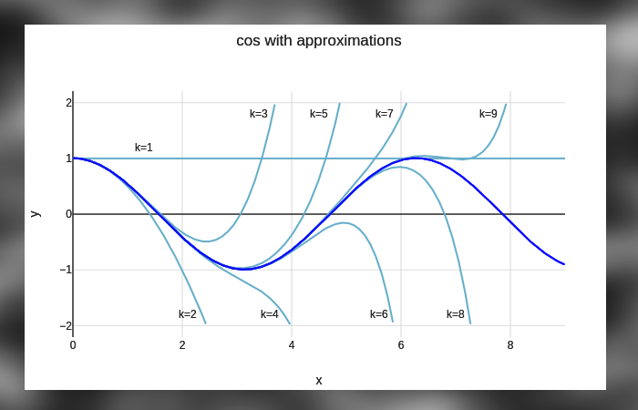

# Taylor Series Programming Assignment

# CS101 Fall 2025: Lab 05

🚀 This assignment will allow you to gain some experience in fixing bugs in Python while you learn about  **approximation in mathematics**. This means, by the end of this lab assignment, you will have a very good idea about how computers (software, actually!) calculate complex functions like $e^x$ and $ln(x)$. To do this approximation, we will have a look at the **Taylot Series** system of approximation as demonstrated by Python. Wow! Let's get started, already!!

## Assigned and Due

* __Assigned__: Thursday, 2nd October 2025 at 2:35pm (two week lab, due to fall break!)
* __Due__: Thursday 16th October 2025 at 2:35pm
* __Expiration__: Thursday, 23rd October 2025 at 2:35pm
Note: the _expiration_ date is the last date you can submit your work for a grade.


Taylor series are a powerful way to approximate complex functions using polynomials. In this figure, they are used to approximate the cosine function.

🚀 Good luck, and happy debugging while learning about a new form of approximation! 🐛→✨

## 🎯 Learning Objectives

By the end of this assignment, you will understand:

- How computers approximate mathematical functions
- What Taylor series are and why they're useful
- How to read error messages and debug Python code
- The relationship between mathematics and programming
- How accuracy improves with more terms in an approximation

## 📚 Mathematical Background

### What are Taylor Series?

Imagine you want to calculate e^2.5 or ln(1.7) by hand. These are impossible to calculate exactly without a calculator! But mathematicians discovered a clever way to approximate these functions using infinite sums called **Taylor series**.

A Taylor series represents a complex function as a sum of simpler terms that provide an approximation. The more terms you include, the closer you get to the actual value.

### Exponential Function (e^x)

If you wanted to approximate e^x, you could use the Taylor series expansion around x=0 and then add the first several terms of the series shown below.

```
e^x = 1 + x + x²/2! + x³/3! + x⁴/4! + x⁵/5! + ...
```

For example, to calculate e^1:

- With 1 term: 1 = 1.0
- With 2 terms: 1 + 1 = 2.0  
- With 3 terms: 1 + 1 + 1²/2 = 2.5
- With 4 terms: 1 + 1 + 1²/2 + 1³/6 = 2.667
- With 5 terms: 1 + 1 + 1²/2 + 1³/6 + 1⁴/24 = 2.708
- **Actual value**: e^1 ≈ 2.71828...

With more terms, we get a more exact approximation. Neat-O, I know!!

### Natural Logarithm (ln(1+x))

To approximate ln(1+x), we can use its Taylor series expansion around zero and arrive at the following series.

```
ln(1+x) = x - x²/2 + x³/3 - x⁴/4 + x⁵/5 - ...
```

Notice the alternating signs (+ - + - + -)!

## 🔧 How Python Actually Calculates These Functions

When you use `math.exp(x)` or `math.log(x)` in Python, the computer doesn't magically know these values. Instead, it uses:

1. **Optimized Taylor series** (like what you are currently programming!)
2. **Lookup tables** for common values (e.g., e^1, e^2, ln(2), ln(10), which are precomputed and stored)
3. **Special mathematical algorithms** that are very fast and accurate and used to compute these functions
4. **Hardware-level optimizations** in modern processors for the fastest calculations possible

Your lab assignment implements the same basic mathematical principles that Python uses internally!

🐛 Your Mission: Debug Detective! This code has **intentional bugs** for you to find and fix. Each bug teaches you something important about programming and mathematics.

---

### Getting Started

We will be using the `uv` tool to manage dependencies and run the code in this project. If you have not installed `uv` yet, then please follow the instructions at https://uvlang.org/install to get the package manager software tool for Python installed on your computer.

**The steps, in case you need them!**

1. **Install dependencies** (this will download required packages):

   ```bash
   uv sync
   ```

2. **Try running the main program**:

You are to runt he code between fixing the bug. Doing so will help you see the effects of your fixes, and help you identify new bugs. Do not worry, there are TODO comments in the code to guide you through these fixes.

   ```bash
   uv run python approximation_taylor_series.py
   ```

3. **You will see error messages!** Done not panic - this is expected. Read them carefully.

When writing code, bugs are inevitable. The key skill is learning how to read error messages and debug effectively. This part of the lab is to help you to recoignize common bugs, understand their error messages from Python, and then determine how to fix them.

### Types of Bugs You will Find

Heads-up!! Below is a listing of common types of bugs you will encounter in this assignment.

🔍 **Import Errors**: Missing `import` statements  
🔍 **Logic Errors**: Wrong mathematical formulas  
🔍 **Range Errors**: Incorrect loop boundaries  
🔍 **Sign Errors**: Wrong positive/negative patterns  
🔍 **Performance Issues**: Inefficient algorithms that become slow  
🔍 **Input Validation**: Missing checks for invalid user input  
🔍 **Index Errors**: Lists that can run out of elements  
🔍 **Edge Cases**: Division by zero and boundary conditions

### How to Debug

1. **Read the error message carefully** - Python tells you exactly what's wrong!
2. **Look for TODO comments** - These tags have hints near-by to provide you with an idea of what is to be done.
3. **Check the line numbers** Each error mentions a traceback with line numbers to help you find the problem in your code. Helpful, right?!
4. **Test your fixes** Make your fix, and then run the code to ensure that you have made the correct change.
5. **Compare your output** Some of the expected output has been included with this document, please check that your output is looking like the stuff you see below.

## TODO Listing and Strategy

__Do not go through all the bugs at once without running your code now and then!!__

Let's talk about how to handle the bug-fixing part of this work. Below, you will note that the bugs are numbered in a specific order to guide your learning you work through the approximation code in your source file; `approximation_taylor_series.py`.

To help you see the flow of the assignment, here is a breakdown of the bugs to fix.

### **Phase 1: Basic Setup (TODOs #1-5)**

- **TODO #1**: Missing import statements - Start here! (Import errors)
- **TODO #2**: Factorial function range error (Loop boundary bug)  
- **TODO #3**: Taylor ln(1+x) alternating signs (Mathematical formula bug)
- **TODO #4-5**: More missing math imports (Additional import errors)

### **Phase 2: Advanced Debugging (TODOs #6-9)**  

- **TODO #6**: File path issues (System portability)
- **TODO #7-8**: Additional math import problems (More import errors)
- **TODO #9**: Summary reminder (Final check)

### **Phase 3: Performance & Validation (TODOs #10-14)**

- **TODO #10**: Performance inefficiency in factorial calculation
- **TODO #11**: Missing input validation for convergence range
- **TODO #12**: Division by zero protection
- **TODO #13**: Array index bounds checking  
- **TODO #14**: User input validation

**💡 Super Hero Tip**: Fix TODOs in order! Earlier bugs may prevent you from discovering later ones.

## 📊 Expected Sample Output

Once you fix all the bugs, running the interactive program should allow you to choose menu options the following.

```text
Taylor Series Demonstration
==================================================
This program demonstrates Taylor series approximations for:
1. e^x (exponential function)
2. ln(1+x) (natural logarithm function)

Choose a function to approximate:
1. e^x
2. ln(1+x)
3. Compare both functions  
4. Show convergence plots
5. Exit

Enter your choice (1-5): 1
Enter a value for x: 1.0
Enter number of terms to use (default 10): 15

Results for e^1.0:
Actual value: 2.7182818285
Taylor approximation (15 terms): 2.7182815256
Absolute error: 3.03e-07
Relative error: 0.000011%
```

**Example of comparing both functions (option 3):**
```text
Enter a value for x: 0.5

Accuracy comparison for x = 0.5
============================================================
Actual e^0.5 = 1.6487212707

Taylor series approximations for e^x:
Terms   Approximation           Error           % Error
------------------------------------------------------------
5       1.6484375000           2.84e-04        0.017280%
10      1.6487212707           7.51e-08        0.000005%
20      1.6487212707           0.00e+00        0.000000%
50      1.6487212707           0.00e+00        0.000000%

Actual ln(1+0.5) = 0.4054651081

Taylor series approximations for ln(1+x):
Terms   Approximation           Error           % Error  
------------------------------------------------------------
5       0.4072916667           1.83e-03        0.450497%
10      0.4054642857           8.15e-06        0.002010%
20      0.4054651081           1.39e-09        0.000000%
50      0.4054651081           2.22e-16        0.000000%
```

### 🧮 What This Output Teaches You

1. **More terms = better accuracy**: Notice how errors get smaller with more terms
2. **Different functions converge differently**: e^x converges faster than ln(1+x)
3. **Approximation has limits**: We can get very close but not always perfect
4. **Scientific notation**: Numbers like `1.82e-05` mean 1.82 × 10^(-5) = 0.0000182

## 🎨 Visualization

After fixing the bugs, you will generate plots showing:

- How Taylor series approximations get closer to the real function
- The difference between using few terms vs. many terms
- Why some functions are easier to approximate than others

## 💡 Debugging Tips

### Common Python Error Messages and What They Mean

- **`NameError: name 'math' is not defined`**
  - **What it means**: You're trying to use `math.exp()` but haven't imported the math module
  - **Fix**: Add `import math` at the top of your file

- **`factorial(5) returns wrong value`**
  - **What to check**: Look at your range in the factorial function
  - **Hint**: To calculate 5!, you need to multiply 1×2×3×4×5

- **`Taylor series giving wrong sign pattern`**
  - **What to check**: The ln(1+x) series should alternate: + - + - + -
  - **Hint**: Look at the exponent in `(-1)**?`

### Testing Your Fixes

After each fix, run the program again and see if:

1. The error messages disappear
2. The output looks reasonable
3. Your approximations get closer to the actual values

## 🔬 Advanced Exploration (Optional)

Once you've fixed all bugs, try experimenting:

1. **Change the number of terms**: What happens with 100 terms? Just 2 terms?
2. **Test different x values**: What happens with x=5 for e^x? What about x=0.99 for ln(1+x)?
3. **Modify the code**: Can you add a Taylor series for sin(x) or cos(x)?

## 📝 Files in This Project

- `approximation_taylor_series.py` - Main program with bugs to fix (start here!)
- `reflection.md` - Reflection questions to complete after debugging
- `pyproject.toml` - Project configuration (you don't need to modify this)

## 📋 Assignment Deliverables

When you complete this assignment, you should submit:

1. **Fixed Source Code**: `approximation_taylor_series.py` with all bugs corrected
   - All 14 TODOs should be resolved
   - Program runs without errors
   - Interactive menu functions properly
   - Plots are generated successfully

2. **Completed Reflection**: `reflection.md` with thoughtful responses
   - All 12 reflection questions answered completely
   - Demonstrates understanding of mathematical and programming concepts
   - Shows personal insights from the debugging experience

## Submission

🚀 As you are working on your lab, you are to commit and push regularly. The commands are the following.

```bash
git add -A
git commit -m ``Your notes about commit here''
git push
```

**Super Important Advice!**

After you have pushed your work to your repository, please visit the repository at the GitHub website (you may have to log-in using your browser) to verify that your files were correctly sent.

## Project Assessment

The grade that a student receives on this assignment will have the following components.

* **GitHub Actions CI Build Status [up to 10%]:**: For the lab01 repository associated with this assignment students will receive a checkmark grade if their last before-the-deadline build passes. This is only checking some baseline writing and commit requirements as well as correct running of the program. An additional reduction will given if the commit log shows a cluster of commits at the end clearly used just to pass this requirement. An addition reduction will also be given if there is no commit during lab work times. All other requirements are evaluated manually.

* **Mastery of Technical Writing [up to 25%]:**: Students will also receive a checkmark grade when the responses to the writing questions presented in the `reflection.md` reveal a proficiency of both writing skills and technical knowledge. To receive a checkmark grade, the submitted writing should have correct spelling, grammar, and punctuation in addition to following the rules of Markdown and providing conceptually and technically accurate answers.

* **Mastery of Technical Knowledge and Skills [up to 65%]**: Students will receive a portion of their assignment grade when their program implementation reveals that they have mastered all of the technical knowledge and skills developed during the completion of this assignment. As a part of this grade, the instructor will assess aspects of the programming including, but not limited to, the completeness and the correctness of the program and the use of effective source code comments.

## Seeking Assistance

Students who have questions about this project outside of the lab time are invited to ask them in the course's Discord channel or during instructor's or TL's office hours.
